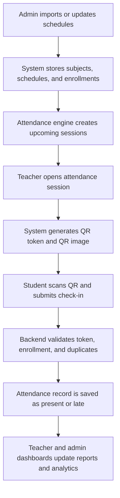

## 1. Product Overview
Smart attendance platform for universities that synchronizes class schedules, opens attendance sessions automatically, and records secure student check-ins through QR codes.
- Solves manual attendance tracking, delayed reports, and duplicate attendance issues for students, teachers, and administrators.
- Delivers capstone value through schedule synchronization, secure check-in validation, and analytics-driven attendance reporting.

## 2. Core Features

### 2.1 User Roles
| Role | Registration Method | Core Permissions |
|------|---------------------|------------------|
| Student | Admin-created or imported account | Sign in, view schedule, scan QR, view attendance history |
| Teacher | Admin-created account | Sign in, view assigned classes, open attendance, view live attendance list, export class reports |
| Admin | Seeded system account | Manage users, subjects, schedules, enrollments, and analytics |

### 2.2 Feature Module
1. **Authentication**: role-based login, JWT session handling, password protection
2. **Student Dashboard**: schedule preview, attendance summary, QR scan entry point, attendance history
3. **Teacher Dashboard**: class session controls, QR generation, session monitoring, report export
4. **Admin Dashboard**: overview metrics, user management, subject management, schedule synchronization
5. **Attendance Engine**: automatic session generation, QR validation, duplicate prevention, late/present classification
6. **Reports and Analytics**: subject reports, student reports, attendance trends, absence and late summaries

### 2.3 Page Details
| Page Name | Module Name | Feature description |
|-----------|-------------|---------------------|
| Sign In | Login form | Email and password entry, role-aware redirect, validation states |
| Student Dashboard | Schedule summary | Shows today's classes, attendance rate, next active session |
| Student Dashboard | QR check-in panel | Opens QR scanner modal and submits token to backend |
| Student Dashboard | Attendance history | Displays past sessions with subject, date, and status |
| Teacher Dashboard | Class session list | Lists today's classes and allows opening a session |
| Teacher Dashboard | Active QR card | Shows generated QR, session timer, and session status |
| Teacher Dashboard | Live attendance table | Updates attendance list with present and late counts |
| Teacher Dashboard | Reports panel | Filters reports by class, date range, and exports CSV |
| Admin Dashboard | Analytics cards | Shows total users, sessions, attendance rate, late rate |
| Admin Dashboard | Management tables | CRUD interface for users, subjects, schedules, enrollments |

## 3. Core Process
Admins manage academic data and schedules, the system prepares attendance sessions, teachers activate sessions during class, and students scan a short-lived QR code to check in. Attendance records are validated, stored, and surfaced in real-time dashboards and reports.

## 4. User Interface Design
### 4.1 Design Style
- Primary color: `#1F4E9B`
- Secondary color: `#3E73C7`
- Deep contrast color: `#0E2A57`
- Accent color: `#F2B233`
- Background color: `#F4F7FC` with white content surfaces
- Button style: rounded medium-radius buttons, high-contrast primary actions, gold call-to-action buttons
- Font direction: bold condensed headings with clean readable sans-serif body text
- Layout style: dashboard-first layout, card-based analytics, fixed top navigation, responsive content grids
- Icon style: clean academic dashboard icons with consistent stroke weight

### 4.2 Page Design Overview
| Page Name | Module Name | UI Elements |
|-----------|-------------|-------------|
| Sign In | Form card | Centered branded card, blue gradient background, gold submit button, subtle academic crest treatment |
| Student Dashboard | Summary cards | White cards with blue headers, gold KPI accents, compact schedule timeline |
| Student Dashboard | Check-in action | Prominent gold scan button, camera status indicator, success and error banners |
| Teacher Dashboard | Session control panel | Deep navy header, QR card with countdown ring, blue data tiles |
| Teacher Dashboard | Attendance table | Sticky filters, searchable roster, colored status pills for present, late, absent |
| Admin Dashboard | Analytics area | Modular charts, metric cards, activity feed, management drawers |

### 4.3 Responsiveness
- Desktop-first layout for teacher and admin dashboards
- Tablet-friendly card stacking for hybrid classroom use
- Mobile-adaptive student experience with touch-friendly scan and history actions
- Consistent spacing system in 4px increments and accessible tap targets
