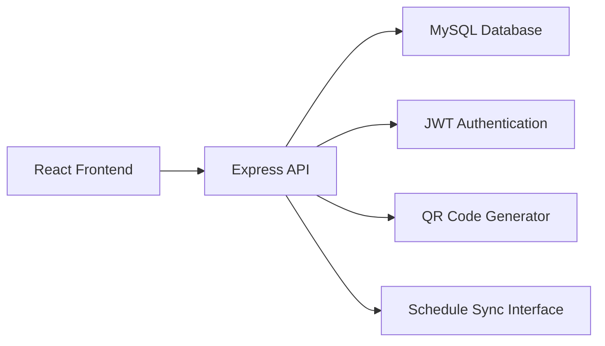
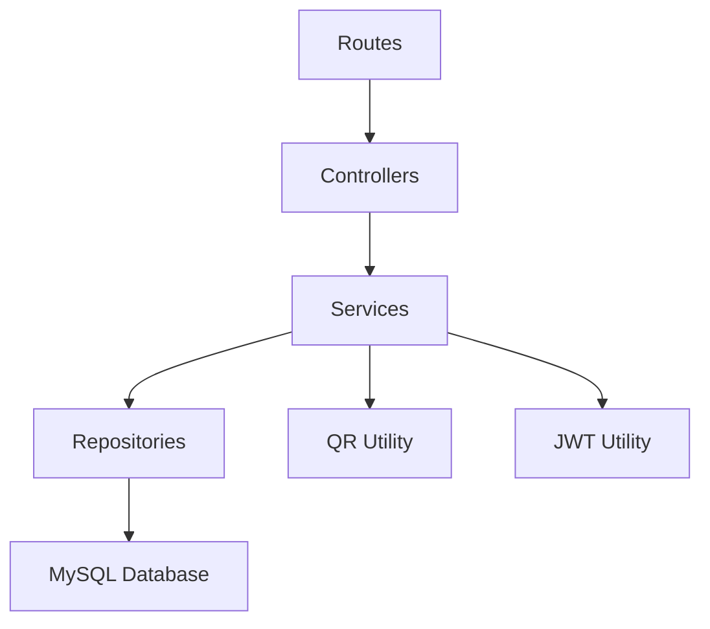
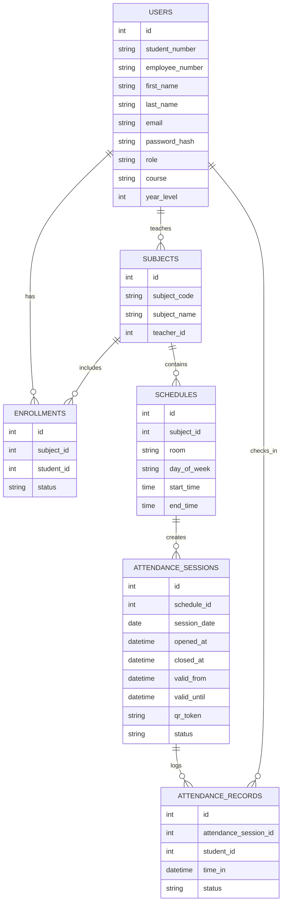

## 1. Architecture Design


## 2. Technology Description
- Frontend: React@18 + TypeScript + Vite + Tailwind CSS + React Router + Zustand
- Backend: Express.js + TypeScript + JWT + bcrypt + qrcode
- Database: MySQL
- Testing: Vitest for frontend and API smoke verification through HTTP requests
- Deployment target: Frontend on Vercel or Render static hosting, backend on Render or Railway

## 3. Route Definitions
| Route | Purpose |
|-------|---------|
| / | Landing page and role-aware entry |
| /login | User authentication page |
| /student | Student dashboard with schedule, scanner, and history |
| /teacher | Teacher dashboard with session controls and reports |
| /admin | Admin dashboard with analytics and management tools |

## 4. API Definitions
```ts
type UserRole = 'student' | 'teacher' | 'admin'
type AttendanceStatus = 'present' | 'late' | 'absent'
type SessionStatus = 'scheduled' | 'open' | 'closed'

interface LoginRequest {
  email: string
  password: string
}

interface LoginResponse {
  token: string
  user: {
    id: number
    firstName: string
    lastName: string
    role: UserRole
    email: string
  }
}

interface AttendanceCheckInRequest {
  qrToken: string
}

interface AttendanceCheckInResponse {
  success: boolean
  message: string
  record?: {
    id: number
    sessionId: number
    status: AttendanceStatus
    timeIn: string
  }
}
```

### Endpoint Summary
| Method | Endpoint | Purpose |
|--------|----------|---------|
| POST | /api/auth/login | Authenticates user and returns JWT |
| GET | /api/schedules | Returns schedules for the signed-in user |
| POST | /api/schedules/sync | Accepts schedule data from scheduler system |
| POST | /api/attendance/open | Opens a class attendance session |
| POST | /api/attendance/checkin | Validates QR token and records student attendance |
| GET | /api/attendance/history | Returns student attendance history |
| GET | /api/reports/class/:subjectId | Returns class attendance report |
| GET | /api/analytics/summary | Returns admin dashboard metrics |

## 5. Server Architecture Diagram


## 6. Data Model
### 6.1 Data Model Definition


### 6.2 Data Definition Language
```sql
CREATE TABLE users (
  id INT PRIMARY KEY AUTO_INCREMENT,
  student_number VARCHAR(50) UNIQUE NULL,
  employee_number VARCHAR(50) UNIQUE NULL,
  first_name VARCHAR(100) NOT NULL,
  last_name VARCHAR(100) NOT NULL,
  email VARCHAR(150) NOT NULL UNIQUE,
  password_hash VARCHAR(255) NOT NULL,
  role ENUM('student', 'teacher', 'admin') NOT NULL,
  course VARCHAR(100) NULL,
  year_level INT NULL,
  created_at DATETIME DEFAULT CURRENT_TIMESTAMP
);

CREATE TABLE subjects (
  id INT PRIMARY KEY AUTO_INCREMENT,
  subject_code VARCHAR(50) NOT NULL UNIQUE,
  subject_name VARCHAR(150) NOT NULL,
  teacher_id INT NOT NULL
);

CREATE TABLE schedules (
  id INT PRIMARY KEY AUTO_INCREMENT,
  subject_id INT NOT NULL,
  room VARCHAR(100) NOT NULL,
  day_of_week VARCHAR(20) NOT NULL,
  start_time TIME NOT NULL,
  end_time TIME NOT NULL
);

CREATE TABLE enrollments (
  id INT PRIMARY KEY AUTO_INCREMENT,
  subject_id INT NOT NULL,
  student_id INT NOT NULL,
  status VARCHAR(30) DEFAULT 'active',
  UNIQUE KEY unique_enrollment (subject_id, student_id)
);

CREATE TABLE attendance_sessions (
  id INT PRIMARY KEY AUTO_INCREMENT,
  schedule_id INT NOT NULL,
  session_date DATE NOT NULL,
  opened_at DATETIME NULL,
  closed_at DATETIME NULL,
  valid_from DATETIME NOT NULL,
  valid_until DATETIME NOT NULL,
  qr_token VARCHAR(255) NOT NULL UNIQUE,
  status ENUM('scheduled', 'open', 'closed') NOT NULL DEFAULT 'scheduled'
);

CREATE TABLE attendance_records (
  id INT PRIMARY KEY AUTO_INCREMENT,
  attendance_session_id INT NOT NULL,
  student_id INT NOT NULL,
  time_in DATETIME NOT NULL,
  status ENUM('present', 'late', 'absent') NOT NULL,
  UNIQUE KEY unique_attendance_record (attendance_session_id, student_id)
);
```
